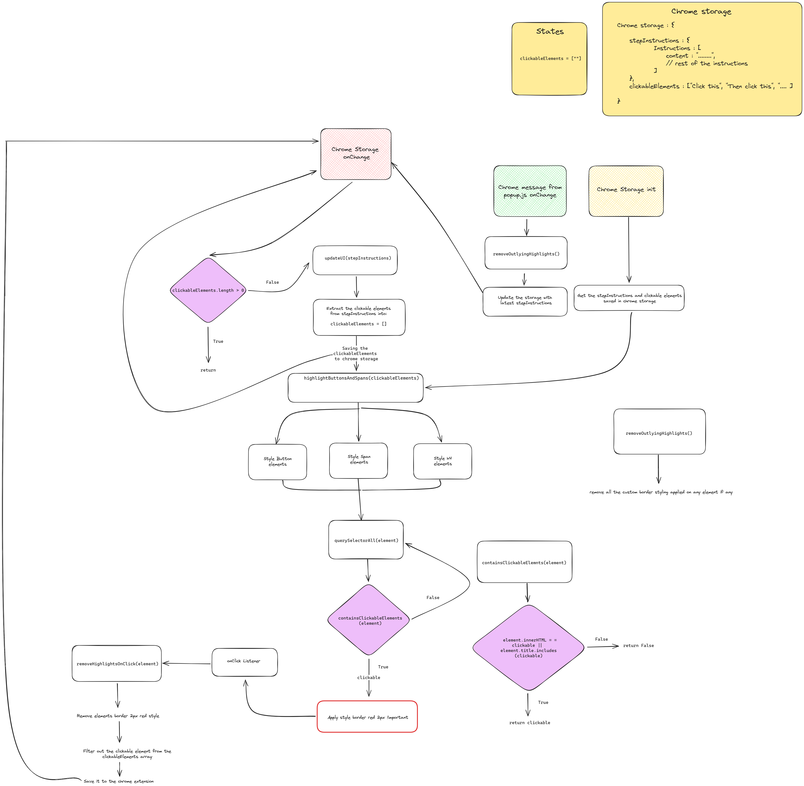

# AWS Chrome Extension with Hugging Face Agent 🚀💡✨

🌟 An AI Chrome extension to teach and guide users on AWS services with step-by-step instructions and interactive UI hints.

## Introduction 💬📚✨
This extension connects to a deployed AI on Hugging Face Spaces to chat, explain AWS services, and highlight relevant buttons, which vanish after clicking.

## Fundamental Flow



## Features 🛠️🤖🚀
- **AI Assistant:** Chat with Hugging Face agent  
- **AWS Lessons:** Learn services & use cases  
- **Interactive Hints:** Highlights disappear after clicking  
- **Real-Time Chat:** Speak to the AI from the extension  
- **Step Guide:** Follow instructions with interactive support  

## Hugging Face Agent 🤖🌐💡
- [AI Agent URL](https://huggingface.co/spaces/Pradipto2002/AWS_Assistant/tree/main)  
- **Model:** llama-3.3-70b-versatile 

## How It Works 💡💬✨
1. **Ask:** Enter queries (e.g., “How to start an EC2?”)  
2. **Reply:** AI provides detailed steps  
3. **Highlight:** UI buttons glow  
4. **Click:** Glow disappears  

## Installation 🖥️🛠️⚙️
- Chrome Browser  
- Hugging Face API URL  

### Setup ⚙️💻📂
1. **Clone:**  
```bash
git clone https://github.com/ggps2002/AWS-AI-Assistant-Chrome-Extension.git
```
2. **Load:** `chrome://extensions/` > `Developer mode` > `Load unpacked` > Select folder   

## Usage 🚀💬🔑
Open extension > Enter AWS query > Follow steps > Click hints (they vanish)

## Structure 🗂️📁📊
```
UI/
├── manifest.json
├── popup.html
├── popup.js
├── content.js
├── background.js
├── README.md
└── webpack.config.js
```

## Contributing 💪💻🌟
1. Fork  
2. Branch (`git checkout -b feature-branch`)  
3. Commit (`git commit -m 'Add feature'`)  
4. Push (`git push origin feature-branch`)  
5. Pull Request  

## License 📜💼✅
Licensed under [MIT License](LICENSE).

